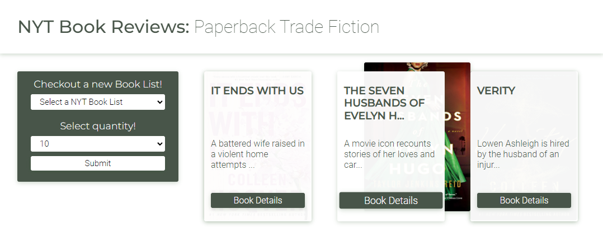

# [NYT Book Reviews](https://spreston4.github.io/nyt-book-review/)



## Description

NYT Book Reviews is a responsive, mobile-friendly, front end application for exploring, and reading reviews for, books on the New York Times Best Sellers list. When the application loads, the user is presented with interactive cards for the top 10 best sellers from the 'Paperback Trade Fiction' category. The user can explore these books, or select another category to explore. The user can also choose to display more, or less, results.


- [Deployed NYT Book Reviews Application](https://spreston4.github.io/nyt-book-review/)

- [GitHub Repo for the NYT Book Reviews application](https://github.com/spreston4/nyt-book-review)

## Table of Contents

- [Intallation](#installation)
- [Usage](#usage)
- [Technologies Used](#technologies-used)
- [Finished Product](#finished-product)
- [Contact Me](#contact-me)

## Installation

1.  Download the project to the location of your choice.
2.  Navigate to the project directory.
3.  From the root of the directory, install the project with the following command:

```
npm install
```
4. Create a .env file in the root of the directory.
5. Copy the contents of the .env.sample file into your .env file.
6. Replace 'YourApiKey' with your NYT API key.

## Usage

1. Navigate to the the project directory.
2. To run locally, run the following command from the root of the directory:

```
npm start
```

3. The user is presented with a library populated with books from the 'Paperback Trade Fiction' category.
4. The user can select to view a different category, or filter the number of results, by utilizing the two dropdown menus. Selecting the 'Submit' button will update their library.
5. Hovering over a book will reveal a glimpse of its cover.
6. Pressing the 'Book Details' button will open a modal with additional information for the selected book.
7. The modal contains a full book description, the author & publisher, the books current ranking on the best sellers list, and how many weeks it has been on the list. It also presents the user with a description of all reviews that are currently available for the book.
8. Selecting the 'Full Review' link redirects the user to the full book review by the NYT.
9. Selecting the 'Find it on Amazon' link redirects the user to the books location on Amazon.
10. Press the 'Close' button to return to the library.


## Technologies Used

Built in Visual Studio with:

- React.js
- JavaScript
- CSS Modules


## Finished Product

- [Deployed NYT Book Reviews Application](https://spreston4.github.io/nyt-book-review/)

### Desktop Version


### Mobile Version


## Contact Me

Questions, comments, or concerns about this project? Contact via e-mail or checkout my GitHub!

- GitHub: [spreston4](https://github.com/spreston4)

- E-mail: [sam.preston11@gmail.com](mailto:sam.preston11@gmail.com)

